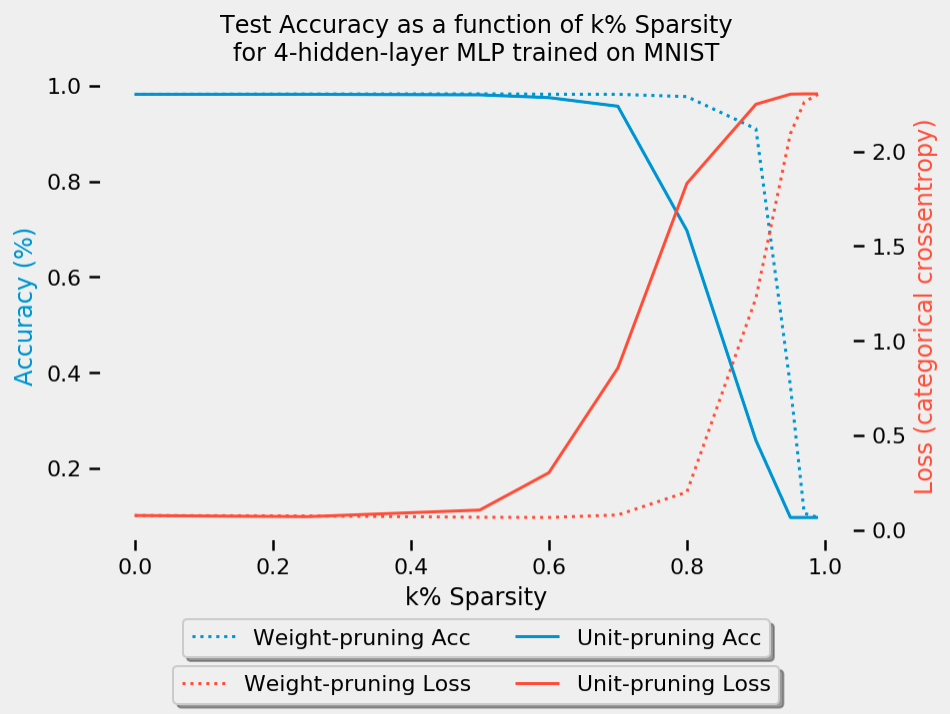

# Keras_pruning

A walkthrough of how to prune keras models using both weight-pruning and unit-pruning.

# Overview

There are multiple ways of optimizing neural-network-based machine learning algorithms. One of these optimizations is the removal of connections between neurons and layers, and thus speeding up computation by reducing the overal number of parameters.

Networks generally look like the one on the left: every neuron in the layer below has a connection to the layer above; but this means that we have to multiply a lot of floats together. Ideally, we’d only connect each neuron to a few others and save on doing some of the multiplications; this is called a “sparse” network.

Given a layer of a neural network $ReLU(xW)$ are two well-known ways to prune it:
- **Weight pruning:** set individual weights in the weight matrix to zero. This corresponds to deleting connections as in the figure above.
    - Here, to achieve sparsity of $k%$ we rank the individual weights in weight matrix $W$ according to their magnitude (absolute value) $|wi,j|$, and then set to zero the smallest $k%$.
- **Unit/Neuron pruning:** set entire columns to zero in the weight matrix to zero, in effect deleting the corresponding output neuron.
    - Here to achieve sparsity of $k%$ we rank the columns of a weight matrix according to their L2-norm $|w| = \sqrt{\sum_{i=1}^{N}(x_i)^2}$ and delete the smallest $k%$.

Naturally, as you increase the sparsity and delete more of the network, the task performance will progressively degrade. This repo serves as a demonstration of **both weight and unit pruning** and compare the performance across both the MNIST and FMNIST datasets.

# Requirements
- [Tensorflow](https://www.tensorflow.org/)
- [Numpy](https://docs.scipy.org)
- [Pandas](https://pandas.pydata.org/)
- [Matplotlib](https://matplotlib.org/)
- [Seaborn](https://seaborn.pydata.org/)

# Installation Instructions

There are two ways to run this notebook:
1. Running in-browser (Google Colab)
- Open this notebook in Google Colab (by [following this link](https://github.com/matthew-mcateer/Keras_pruning/blob/master/Model_pruning_exploration.ipynb))
2. Running locally
- Clone this repository with the following command: `git clone https://github.com/matthew-mcateer/Keras_pruning.git`
- Run `jupyter Model_pruning_exploration.ipynb`
- Optional: before running the notebook, create a separate environment using `conda` and install the Requirements above in the environment. Activate your `conda` environment before running Jupyter.

# References/Resources

- ["Pruning deep neural networks to make them fast and small"](https://jacobgil.github.io/deeplearning/pruning-deep-learning), _Jacob's Computer Vision and Machine Learning blog_
- Molchanov, Pavlo, et al. ["Pruning convolutional neural networks for resource efficient inference."](https://arxiv.org/abs/1611.06440) arXiv preprint arXiv:1611.06440 (2016).
- Li, Hao, et al. ["Pruning filters for efficient convnets."](https://arxiv.org/abs/1608.08710) arXiv preprint arXiv:1608.08710 (2016).
- Saliency map. _Wikipedia_. https://en.wikipedia.org/wiki/Saliency_map
- http://yann.lecun.com/exdb/publis/pdf/lecun-90b.pdf
- Frankle, Jonathan, and Michael Carbin. ["The lottery ticket hypothesis: Finding sparse, trainable neural networks."](https://arxiv.org/abs/1803.03635) arXiv preprint arXiv:1803.03635 (2018).
- Zhang, Jiayao, Guangxu Zhu, and Robert W. Heath Jr. ["Grassmannian Learning: Embedding Geometry Awareness in Shallow and Deep Learning."](https://arxiv.org/abs/1808.02229) arXiv preprint arXiv:1808.02229 (2018).
- [Generating Large Images From Latent Vectors](http://blog.otoro.net/2016/04/01/generating-large-images-from-latent-vectors/). _David Ha's blog_
- Zhou, Hattie, et al. ["Deconstructing lottery tickets: Zeros, signs, and the supermask."](https://eng.uber.com/deconstructing-lottery-tickets/) arXiv preprint arXiv:1905.01067 (2019).
